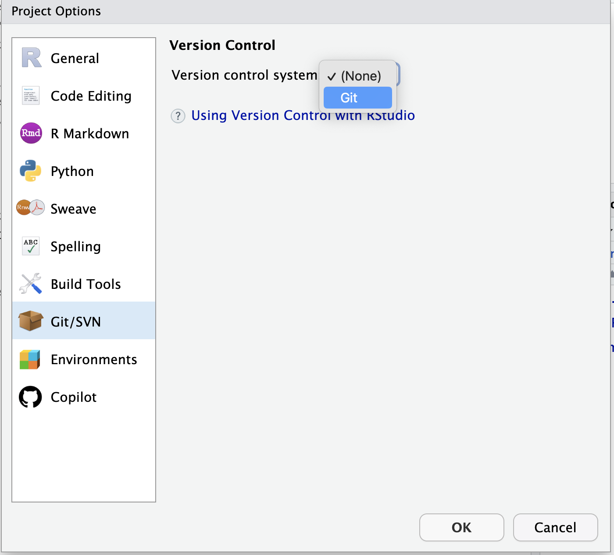
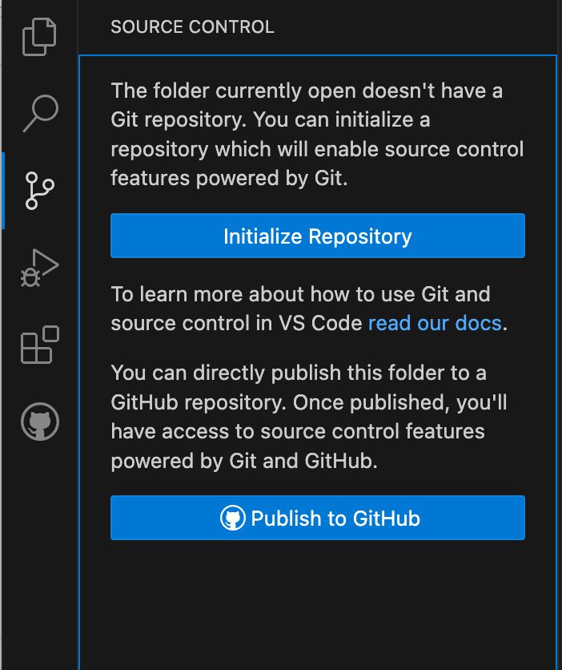
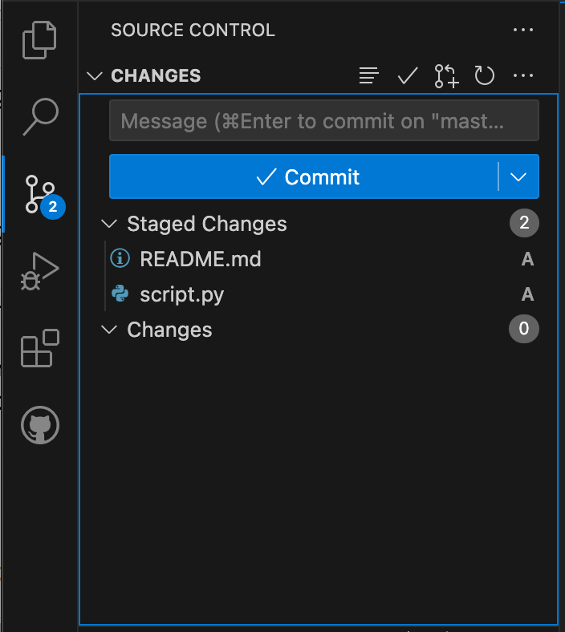

::: questions
-   How do I share my changes with others on the web?
:::

::: objectives
-   Create a repository on GitHub
-   Push to or pull from a remote repository.
:::

## Creating a GitHub repository

You are going to add your existing project to GitHub

::: challenge
## Exercise: Create a GitHub repository

Log in to [GitHub](https://github.com){target="_blank"}, then click on the icon in the top right corner to create a new repository.

{alt="Creating a Repository on GitHub (Step 1)"}

-   Give your repository the name of your project.
-   Make the repository Public
-   Keep the box for "Add a README" unchecked.
-   Keep "None" as options for both "Add .gitignore" and "Add a license."

Then click "Create Repository".

{alt="Creating a Repository on GitHub (Step 2)"}

As soon as the repository is created, GitHub displays a page with a URL and some information on how to configure your local repository:

{alt="Creating a Repository on GitHub (Step 3)"}
:::

## Pushing existing code to GitHub

Below are steps for pushing your existing code to GitHub using RStudio or Visual Studio Code. 
There are many tools to push your code to GitHub (including the command line), but if you are not used to doing this we recommend one of these options.

First install [RStudio](https://posit.co/download/rstudio-desktop/){target="_blank"} (recommended for R users) 
or [Visual Studio Code](https://code.visualstudio.com/){target="_blank"}.

::::: challenge
## Exercise: Push your existing code to GitHub

::: group-tab
### RStudio

Make sure that next to RStudio, Git is installed on your system and activated in RStudio. 
Please refer to [these installation instructions from RStudio](https://docs.posit.co/ide/user/ide/guide/tools/version-control.html){target="_blank"} 
and these instructions on [how to configure GitHub for RStudio](https://gist.github.com/Z3tt/3dab3535007acf108391649766409421){target="_blank"}.

Next, you need to initialize git (version control) for your Project:

In Rstudio, open the [RStudio Project](https://support.posit.co/hc/en-us/articles/200526207-Using-RStudio-Projects){target="_blank"} 
that you want to add to GitHub. Go to 'Tools \> Version control \> Project setup...'

Select 'Git' as the Version Control System

{alt="Initializing version control in RStudio Project"}

Then confirm that you want to initialize a new git repository for the project.

'Confirm New Git Repository' and then confirm that you want to restart RStudio.

After restarting RStudio, your project is reopened and a 'Git' Version Control tab is added.

If you click on it, you see the following:

{alt="The Git tab in an RStudio Project"}

The next step is to add all your files to be “monitored”.

*Note that RStudio automatically adds files you want to ignore in a .gitignore file. You can add certain files (e.g. sensitive data that should not be uploaded) yourself if needed.*

In the Git tab, you can tick the files that you want to upload. Then you click on 'Commit pending changes'.

A new window will open. Here you can add a so-called commit message.

Use something descriptive, in this case for example "Initial commit" and click on 'Commit'.

Now, you want to link to your project on GitHub. The home page of the repository on GitHub includes the URL string we need to identify:

{alt="Where to Find Repository URL on GitHub"}

Make sure to copy the HTTPS link and not the SSH link.

-   **Linux and Mac**

On a linux-based machine (including Mac OS), you should be able to go back to RStudio, and open a new Terminal window:

Go to Tools in the menu bar, select Terminal, and then New Terminal

Then paste in the three commands from the GitHub page, into the terminal window and press enter:

``` bash
git remote add origin https://github.com/yourusername/my-awesome-project.git
git branch -M main
git push -u origin main
```

Refresh the home page of your repository on GitHub to verify that your code is there.

-   **Windows**

On a windows machine, set RStudio to open Git Bash terminals instead of Command Prompt or Windows Powershell.

Go to Tools in the menu bar and select 'Terminal Options'.

Select Git Bash from the drop down menu, select Apply, then OK.

You can then open a new terminal window by going to 'Tools \> Terminal \> New Terminal'.

In the new terminal window, paste in the three commands from the GitHub page and press enter:

``` bash
git remote add origin https://github.com/yourusername/my-awesome-project.git
git branch -M main
git push -u origin main
```

Refresh the home page of your repository on GitHub to verify that your code is there.

### Visual Studio Code

The following instructions are based on the use of Visual Studio Code as a code editor, which offers support for development operations like debugging, task running, and version
control. You can download [Visual Studio Code here](https://code.visualstudio.com/){target="_blank"} for free (and [disable reporting](https://code.visualstudio.com/docs/supporting/faq#_how-to-disable-telemetry-reporting){target="_blank"} your usage if you like).

Make sure that next to Visual Studio Code, [Git](https://git-scm.com/downloads){target="_blank"} is installed on your system.

Next, you need to initialize git (version control) for your Project:

In Visual Studio Code, open the folder of the project that you want to add to GitHub. 
Then click on 'Source Control' and 'Initialize Repository':

{alt="Initializing version control in Visual Studio Code"}

Now, you can stage files by clicking on the '+' next to 'Changes' or next to the individual files:

{alt="Staging files in Visual Studio Code"}

An 'A' will denote that the files are now added, and they are in the category 'Staged Changes':

{alt="Staged files in Visual Studio Code"}

Then you click on 'Commit'. Then you are asked to add a so-called commit message. When you accept and save
that message, you can publish the remote on GitHub by clicking the blue 'Publish Branch' button that should now
be available.  

When you do so you are asked to sign in to GitHub and authorize Visual Studio Code via the browser. After that, you
will return to Visual Studio Code and you should click 'Publish to public GitHub Repository'.

Refresh the home page of your repository on GitHub to verify that your code is there.

:::
:::::

::: callout
## Wait, what did we just do?

These are the basics for uploading a project to GitHub. We realize we are skipping a lot of details on how git works and how to use it. Our excuse is we want reproducible code on GitHub within a day.

If you want to learn more about git later, you can follow [this great lesson](https://swcarpentry.github.io/git-novice/){target="_blank"}.
:::

::: challenge
## Optional exercise: My code is already on GitHub

If your code is already on GitHub you can try to help others pushing their code to GitHub, or explore the following topics:

-   [Familiarize yourself with the basics of `git`](https://swcarpentry.github.io/git-novice/){target="_blank"}
-   [Learn more about `.gitignore` files](https://swcarpentry.github.io/git-novice/06-ignore.html){target="_blank"}
-   If you already know the basics of `git`, familiarize yourself with best practices in using git with [this lesson](https://carpentries-incubator.github.io/python-intermediate-development/14-collaboration-using-git/index.html){target="_blank"}. This lesson assumes you have some project with changes to it, you can make some changes in the project you are working on today to mimic the lesson.
:::

::: keypoints
-   Use GitHub in the browser to create a remote repository
-   Use `git init` to initialize a local repository
-   Use `git add .` to add all your files to be "monitored" by git
-   USe `git commit` to commit your changes
-   Use `git push` to upload your local project to GitHub
:::
