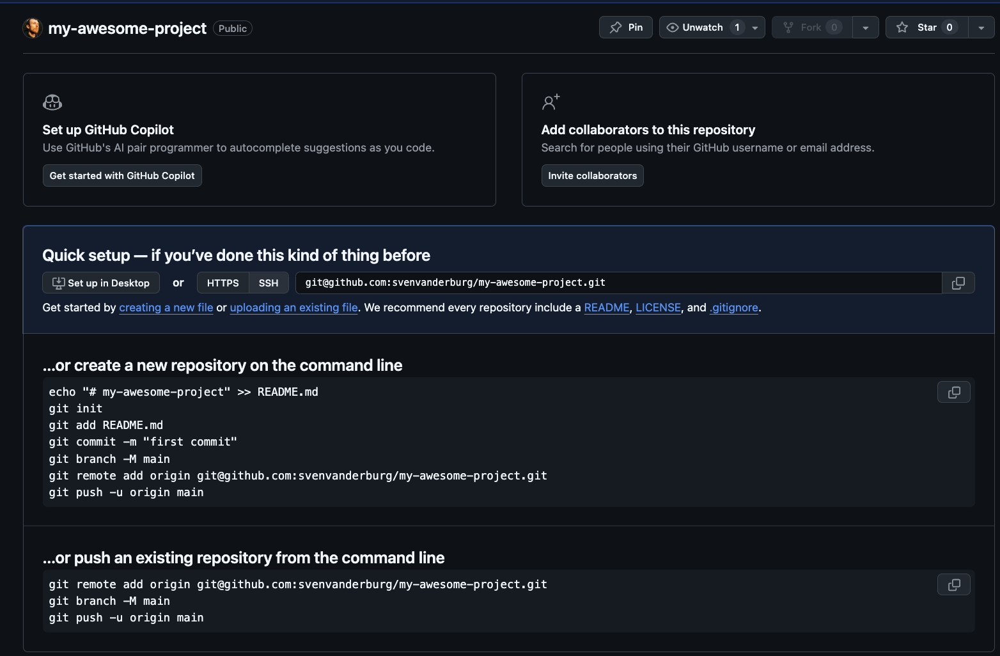

:::::::::::::::::::::::::::::::::::::: questions 

- How do I share my changes with others on the web?

::::::::::::::::::::::::::::::::::::::::::::::::

::::::::::::::::::::::::::::::::::::: objectives

- Create a repository on GitHub
- Push to or pull from a remote repository.

::::::::::::::::::::::::::::::::::::::::::::::::

## Creating a GitHub repository

You are going to add your existing project to GitHub

::::::::::::::::::::::::::::::::::::: challenge 

## Exercise: Create a GitHub repository
Log in to [GitHub](https://github.com), then click on the icon in the top right corner to
create a new repository.

{alt='Creating a Repository on GitHub (Step 1)'}

- Give your repository the name of your project.
- Make the repository Public
- Keep the box for "Add a README" unchecked.
- Keep "None" as options for both "Add .gitignore" and "Add a license."

Then click "Create Repository".

{alt='Creating a Repository on GitHub (Step 2)'}

As soon as the repository is created, GitHub displays a page with a URL and some
information on how to configure your local repository:

{alt='Creating a Repository on GitHub (Step 3)'}

::::::::::::::::::::::::::::::::::::::::::::::::


## Pushing existing code to GitHub
Below are steps for pushing your existing code to GitHub using the command line.
We recommend using the command line. 
You need to get used to it, but once you are used to it will make your life as a coder easier.

First install Shell and Git. Please refer to [these installation instructions](https://coderefinery.github.io/installation/git-in-terminal/#installation).

If you prefer uploading your project to GitHub using a git GUI like [GitHub Desktop](https://desktop.github.com/) 
or [Sourcetree](https://www.sourcetreeapp.com/),
or an IDE with support for git like VSCode, 
you can also use that, but we do not provide instructions for it. 

::: challenge
## Exercise: Push your existing code to GitHub using the command line
On your computer, go to the directory of the project you want to add to GitHub using the terminal (git Bash for Windows). 
You can use the `cd` command to move into the directory. 
From here you run the following commands to "connect" your existing project to your repo on GitHub. 
(This is assuming that you created your repo on GitHub and it is currently empty)

First do this to initialize git (version control).
```bash
git init
```

Then do this to add all your files to be "monitored." 
If you have files that you want ignored, you need to add a `.gitignore` file but for the sake of simplicity, just use this example to learn.

```bash
git add .
```

Then you commit and add a note in between the "" like "first commit" etc.

``` bash
git commit -m "Initial Commit"
```

Now, we want to link to your project on GitHub.
The home page of the repository on GitHub includes the URL string we need to
identify it:

{alt='Where to Find Repository URL on GitHub'}

Make sure to copy the HTTPS link and not the SSH link.

Then use below command to connect the local repository to the repository in GitHub

```
git remote add github <project url>
```


Test to see that it worked by doing

```bash
git remote -v
```

You should see what your repo is linked to.

Then you can push your changes to GitHub

```bash
git push origin main
```

Refresh the home page of your repository on GitHub to verify that your code is there.
:::

::: callout
## Wait, what did we just do?
These are the basics for uploading a project to GitHub. 
We realize we are skipping a lot of details on how git works and how to use it. 
Our excuse is we want reproducible code on GitHub within a day.

If you want to learn more about git later, you can follow a [this great lesson](https://swcarpentry.github.io/git-novice/).

:::

::: challenge
## Optional exercise: My code is already on GitHub
If your code is already on GitHub you can try to help others pushing their code to GitHub, or explore the following topics:

- [Familiarize yourself with the basics of `git`](https://swcarpentry.github.io/git-novice/)
- [Learn more about `.gitignore` files](https://swcarpentry.github.io/git-novice/)
- If you already know the basics of `git`, familiarize yourself with best practices in using git with [this lesson](https://carpentries-incubator.github.io/python-intermediate-development/14-collaboration-using-git/index.html). 
This lesson assumes you have some project with changes to it, you can make some changes in the project you are working on today to mimic the lesson.


:::

:::::::::::::::::::::::::::::::::::::::: keypoints

- Use GitHub in the browser to create a remote repository
- Use `git init` to initialize a local repository
- Use `git add . ` to add all your files to be "monitored" by git
- USe `git commit` to commit your changes
- Use `git push` to upload your local project to GitHub

::::::::::::::::::::::::::::::::::::::::::::::::::

[r-markdown]: https://rmarkdown.rstudio.com/
