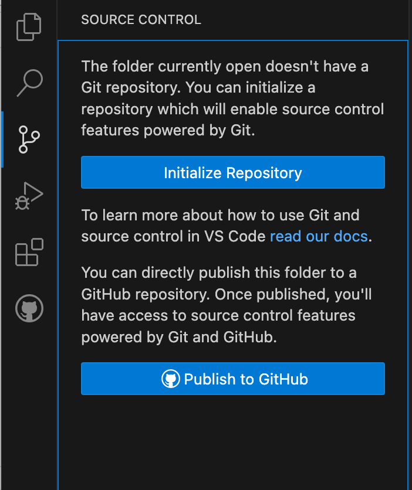
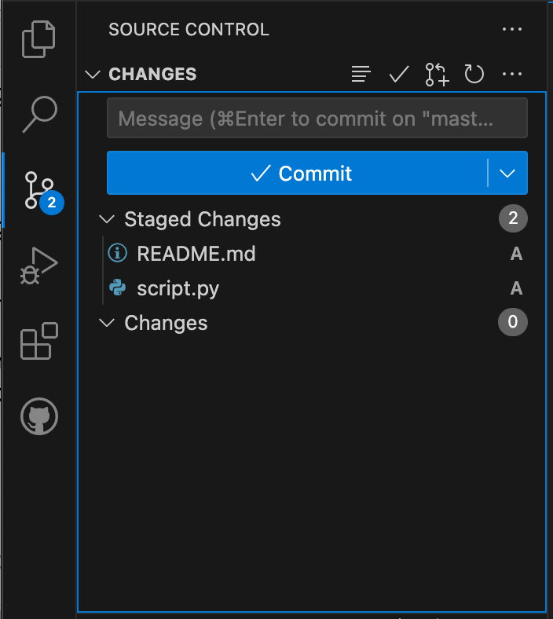

::: questions
-   How do I share my changes with others on the web?
:::

::: objectives
-   Create a repository on GitHub
-   Push to or pull from a remote repository
:::

## Install Git and create a GitHub account

You are going to add your existing project to GitHub. This is important for multiple reasons:

1.  Your project will be under version control. This means that you and others can from now on track the exact history of changes.

2.  You will have an external copy of your code on GitHub. If for some reason you lose your local copy, you can always 'clone' the repository on GitHub back to your local system (to continue working there).

3.  By publishing your code on GitHub, your code is now available for others for re-use.

The exercises on this page should be done before the workshop. This will help us to focus on improving the code during the workshop day.

:::: challenge
## Exercise: Install Git and create a GitHub account

You need to have Git installed on your local system:

### Install Git

::: tab
### Windows

Download the Git for Windows [installer](https://gitforwindows.org/). Then run the installer.

### Mac

Most versions of MacOS will have git preinstalled, you can check by running the following commands in the Terminal:

``` bash
$ git --version
```

If it is not available, you can install git through homebrew by running:

``` bash
brew install git
```

### Linux

If Git is not already available on your machine you can install this package via your distro's package manager. Debian/Ubuntu run `sudo apt-get install git` and for Fedora run `sudo dnf install git`.
:::

#### Create a GitHub account

You will need an account for [GitHub](https://github.com/) to publish your code there.

1.  To sign up for an account, navigate to <https://github.com/> and follow the prompts.
2.  Verify your email address.
3.  Configure GitHub authentication.
::::

::: challenge
## Optional exercise: My code is already on GitHub

If your code is already on GitHub you can explore the following topics:

-   [Familiarize yourself with the basics of `git`](https://swcarpentry.github.io/git-novice/){target="_blank"}
-   [Learn more about `.gitignore` files](https://swcarpentry.github.io/git-novice/06-ignore.html){target="_blank"}
-   If you already know the basics of `git`, familiarize yourself with best practices in using git with [this lesson](https://carpentries-incubator.github.io/python-intermediate-development/14-collaboration-using-git/index.html){target="_blank"}. This lesson assumes you have some project with changes to it, you can make some changes in the project you are working on today to mimic the lesson.
:::

## Pushing existing code to GitHub

Below are steps for pushing your existing code to GitHub using RStudio or Visual Studio Code. There are many tools to push your code to GitHub (including the command line), but if you are not used to doing this we recommend one of these options.

First install [RStudio](https://posit.co/download/rstudio-desktop/){target="_blank"} (recommended for R users) or [Visual Studio Code](https://code.visualstudio.com/){target="_blank"}.

:::: challenge
## Exercise: Push your existing code to GitHub

::: group-tab
### RStudio

Make sure that next to RStudio, Git is installed on your system and activated in RStudio. Please refer to [these installation instructions from RStudio](https://docs.posit.co/ide/user/ide/guide/tools/version-control.html){target="_blank"} and these instructions on [how to configure GitHub for RStudio](https://gist.github.com/Z3tt/3dab3535007acf108391649766409421){target="_blank"}.

Next, you need to initialize git (version control) for your Project:

In Rstudio, open the [RStudio Project](https://support.posit.co/hc/en-us/articles/200526207-Using-RStudio-Projects){target="_blank"} that you want to add to GitHub. Go to 'Tools \> Version control \> Project setup...'

Select 'Git' as the Version Control System

{alt="Initializing version control in RStudio Project"}

Then confirm that you want to initialize a new git repository for the project.

'Confirm New Git Repository' and then confirm that you want to restart RStudio.

After restarting RStudio, your project is reopened and a 'Git' Version Control tab is added.

If you click on it, you see the following:

{alt="The Git tab in an RStudio Project"}

The next step is to add all your files to be “monitored”.

*Note that RStudio automatically adds files you want to ignore in a .gitignore file. You can add certain files (e.g. sensitive data that should not be uploaded) yourself if needed.*

In the Git tab, you can tick the files that you want to upload. Then you click on 'Commit pending changes'.

A new window will open. Here you can add a so-called commit message.

Use something descriptive, in this case for example "Initial commit" and click on 'Commit'.

Now, you want to publish your project on GitHub. We will use the `usethis` package to do so. Make sure you have it installed (otherwise type `install.packages('usethis')`), and run the following commands in the RStudio Console:

``` r
library(usethis)
use_github()
```

A new repository based on your project name will be created on GitHub and will automatically open into your browser. Verify that your code is there.

### Visual Studio Code

The following instructions are based on the use of Visual Studio Code as a code editor, which offers support for development operations like debugging, task running, and version control. You can download [Visual Studio Code here](https://code.visualstudio.com/){target="_blank"} for free (and [disable reporting](https://code.visualstudio.com/docs/supporting/faq#_how-to-disable-telemetry-reporting){target="_blank"} your usage if you like).

Make sure that next to Visual Studio Code, [Git](https://git-scm.com/downloads){target="_blank"} is installed on your system.

Next, you need to initialize git (version control) for your Project:

In Visual Studio Code, open the folder of the project that you want to add to GitHub. Then click on 'Source Control' and 'Initialize Repository':

{alt="Initializing version control in Visual Studio Code"}

Now, you can stage files by clicking on the '+' next to 'Changes' or next to the individual files:

{alt="Staging files in Visual Studio Code"}

An 'A' will denote that the files are now added, and they are in the category 'Staged Changes':

{alt="Staged files in Visual Studio Code"}

Then you click on 'Commit'. Then you are asked to add a so-called commit message. When you accept and save that message, you can publish the remote on GitHub by clicking the blue 'Publish Branch' button that should now be available.

When you do so you are asked to sign in to GitHub and authorize Visual Studio Code via the browser. After that, you will return to Visual Studio Code and you should click 'Publish to public GitHub Repository'.

A new repository based on your project name will be created on GitHub and will automatically open into your browser. Verify that your code is there.
:::
::::

::: callout
## Wait, what did we just do?

These are the basics for uploading a project to GitHub. We realize we are skipping a lot of details on how git works and how to use it. Our excuse is we want reproducible code on GitHub within a day.

If you want to learn more about git later, you can follow [this great lesson](https://swcarpentry.github.io/git-novice/){target="_blank"}.
:::

::: keypoints
-   Install Git and create a GitHub account
-   Initialize a local git repository for your project
-   Add your files to be "monitored" by git
-   Commit your changes accompanied by a commit message
-   Push your local project to GitHub
:::
